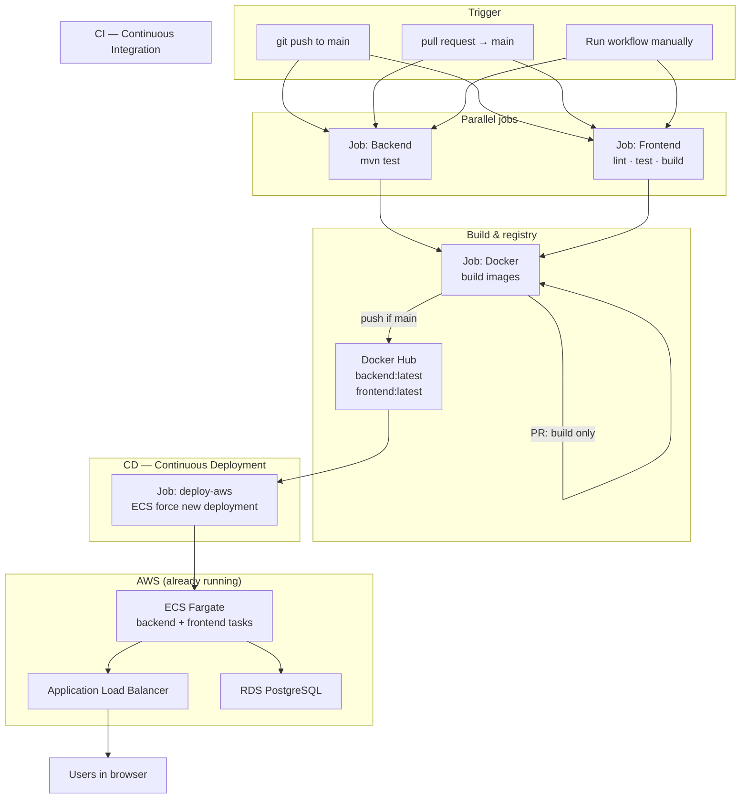
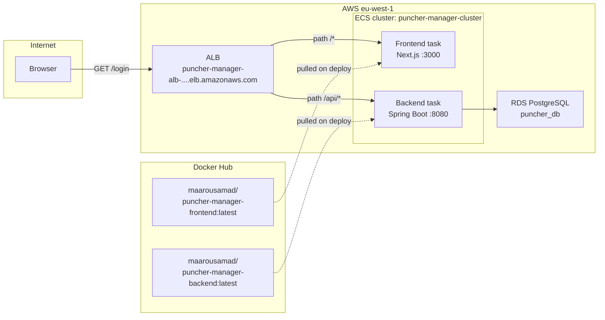
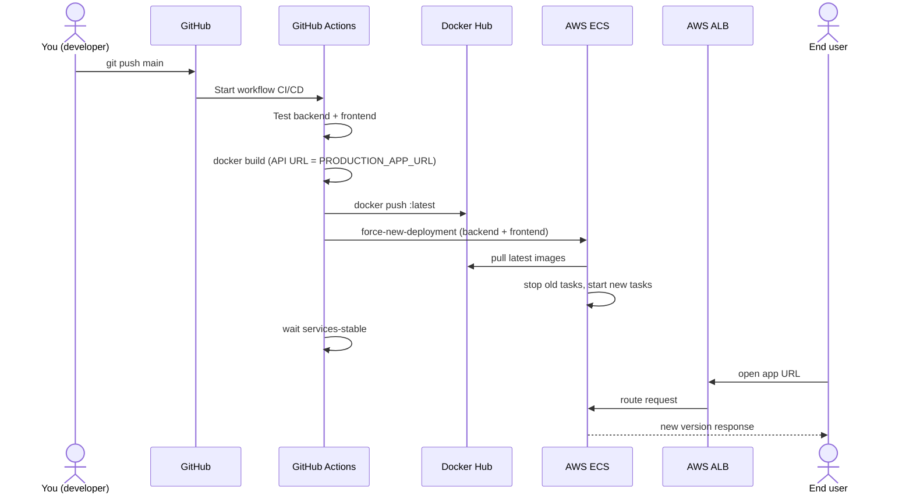

# CI/CD explained (beginner guide)

This document explains **every step** from `git push` to your app running on AWS, in plain language.

**Live pipeline file:** `.github/workflows/ci.yml`  
**Your app URL:** `http://puncher-manager-alb-165407361.eu-west-1.elb.amazonaws.com`

---

## The big picture

```text
You: git push to main on GitHub
         │
         ▼
┌────────────────────────────────────────────────────────────┐
│  GitHub Actions (cloud computers that run your pipeline)   │
│                                                            │
│  1. CI — "Is the code good?"                               │
│     • Backend tests (Maven / JUnit)                        │
│     • Frontend lint + tests + build                        │
│                                                            │
│  2. Build Docker images                                    │
│     • Package backend + frontend into containers           │
│     • Frontend uses your real AWS URL (not localhost)      │
│     • Push images to Docker Hub                            │
│                                                            │
│  3. CD — "Put new version on AWS"                          │
│     • Tell ECS to restart services with new images         │
└────────────────────────────────────────────────────────────┘
         │
         ▼
AWS: Load Balancer → ECS tasks → RDS database
         │
         ▼
Users open your URL in the browser
```

---

## CI/CD schema (diagrams)

### 1. Pipeline schema — jobs and order

This is the **automation** side: what GitHub Actions runs after you push.



| Arrow | Meaning |
|-------|--------|
| Backend + Frontend **in parallel** | Both must pass before Docker runs (`needs: [backend, frontend]`). |
| Docker → Docker Hub | Only on **push to `main`** (not on PRs). |
| Docker Hub → deploy-aws | ECS pulls `:latest` images after you push. |
| deploy-aws → ECS | `aws ecs update-service --force-new-deployment` (no Terraform on each push). |

---

### 2. Runtime schema — how AWS serves traffic

This is the **live app** side (created once with Terraform; stays up between deploys).



| Path on ALB | Goes to | Example |
|-------------|---------|---------|
| `/api/*` | Backend container | `POST /api/auth/login` |
| Everything else (`/`, `/login`, …) | Frontend container | Login page, dashboard |

The browser calls **one host** (the ALB). `NEXT_PUBLIC_API_URL` must be that host so login does not use `localhost`.

---

### 3. Sequence schema — one full deploy (push to `main`)



---

### 4. Trigger matrix (what runs when)

| Event | Backend tests | Frontend tests | Push images | Deploy ECS |
|-------|:-------------:|:--------------:|:-----------:|:----------:|
| PR → `main` | Yes | Yes | No | No |
| Push → `main` | Yes | Yes | Yes | Yes |
| Manual run on `main` | Yes | Yes | Yes | Yes |
| Push to other branch | No* | No* | No | No |

\*Unless you open a PR targeting `main` — then only the PR column applies.

---

### 5. Secrets and variables in the schema

```text
┌──────────────────── GitHub repo ────────────────────┐
│  Secrets (encrypted)          Variables (plain)      │
│  • DOCKERHUB_USERNAME         • AWS_REGION           │
│  • DOCKERHUB_TOKEN            • ECS_CLUSTER          │
│  • AWS_ACCESS_KEY_ID          • ECS_SERVICE_BACKEND  │
│  • AWS_SECRET_ACCESS_KEY      • ECS_SERVICE_FRONTEND │
│  • PRODUCTION_APP_URL                              │
└──────────────────────────┬──────────────────────────┘
                           │ used during workflow
                           ▼
              Docker build · AWS CLI deploy
```

| Name | Used in job | Purpose |
|------|-------------|---------|
| `PRODUCTION_APP_URL` | Docker (frontend) | Bakes API URL into Next.js bundle |
| `DOCKERHUB_*` | Docker | Login and push images |
| `AWS_*` | deploy-aws | Authenticate to AWS |
| `ECS_*` variables | deploy-aws | Which cluster/services to restart |

---

## Terms glossary

| Term | Simple meaning |
|------|----------------|
| **Git** | Version control — tracks changes to your code. |
| **GitHub** | Website that hosts your Git repository. |
| **Push** | Upload your commits from your PC to GitHub. |
| **`main` branch** | The primary line of code; production usually deploys from here. |
| **Pull request (PR)** | Proposal to merge a branch into `main`; runs checks but does **not** deploy. |
| **CI (Continuous Integration)** | Automatically **test and build** on every push/PR. |
| **CD (Continuous Deployment)** | Automatically **release** to AWS after CI passes on `main`. |
| **CI/CD** | CI + CD together — push code → tests → deploy. |
| **Workflow** | YAML file in `.github/workflows/` that defines the pipeline. |
| **Job** | A block of work in a workflow (e.g. "Backend tests"). Jobs can run in parallel. |
| **Step** | One action inside a job (checkout, run tests, deploy). |
| **Runner** | Temporary Linux VM GitHub starts to run your workflow. |
| **Secret** | Encrypted value in GitHub (passwords, tokens). Never put secrets in code. |
| **Variable** | Non-secret config in GitHub (region name, cluster name). |
| **Docker** | Tool to package an app + dependencies into an **image**. |
| **Image** | Read-only template for a container (like a snapshot). |
| **Container** | Running instance of an image. |
| **Docker Hub** | Public registry where your images are stored (`maarousamad/...`). |
| **Tag** | Label on an image (`latest`, `abc1234`). ECS pulls by tag. |
| **Build arg** | Value passed when building an image (`NEXT_PUBLIC_API_URL`). |
| **AWS** | Amazon’s cloud (servers, databases, load balancers). |
| **ECS (Elastic Container Service)** | Runs Docker containers on AWS without managing servers. |
| **Fargate** | Serverless mode for ECS — AWS manages the machines. |
| **Task** | One running copy of your container(s) on ECS. |
| **Service** | Keeps tasks running (restarts if they crash, rolls out updates). |
| **Cluster** | Group of ECS services (`puncher-manager-cluster`). |
| **ALB (Application Load Balancer)** | Public URL that sends `/api/*` to backend and `/` to frontend. |
| **RDS** | Managed PostgreSQL database. |
| **Terraform** | Infrastructure as code — created VPC, RDS, ECS, ALB (one-time setup). |
| **Force new deployment** | ECS stops old tasks and starts new ones (pulls fresh `latest` image). |

---

## What happens on each type of event

| Event | Tests | Push Docker images | Deploy AWS |
|-------|-------|-------------------|------------|
| PR to `main` | Yes | No (build only) | No |
| Push to `main` | Yes | Yes (`latest` + commit SHA) | Yes |
| Manual "Run workflow" | Yes | Yes (if on `main`) | Yes (if on `main`) |

---

## One-time setup (you do this once)

### 1. Infrastructure (already done)

You ran **Terraform** and created VPC, RDS, ECS, ALB. That is **not** repeated on every push — only when you change infrastructure.

### 2. GitHub Secrets

Repository → **Settings** → **Secrets and variables** → **Actions** → **Secrets**:

| Secret name | What to put |
|-------------|-------------|
| `DOCKERHUB_USERNAME` | `maarousamad` (your Docker Hub user) |
| `DOCKERHUB_TOKEN` | Docker Hub access token (**Write** permission) |
| `AWS_ACCESS_KEY_ID` | From IAM user (see below) |
| `AWS_SECRET_ACCESS_KEY` | From IAM user |
| `PRODUCTION_APP_URL` | `http://puncher-manager-alb-165407361.eu-west-1.elb.amazonaws.com` |

### 3. GitHub Variables (non-secret)

Same page → **Variables** tab:

| Variable name | Example value |
|---------------|---------------|
| `AWS_REGION` | `eu-west-1` |
| `ECS_CLUSTER` | `puncher-manager-cluster` |
| `ECS_SERVICE_BACKEND` | `puncher-manager-backend` |
| `ECS_SERVICE_FRONTEND` | `puncher-manager-frontend` |

### 4. IAM user for GitHub (deploy only)

In AWS Console → **IAM** → **Users** → **Create user** (e.g. `github-actions-puncher`):

1. Attach policy from file `deploy/aws/github-actions-deploy-policy.json` (in this repo).
2. Create **access key** → Application outside AWS.
3. Copy **Access key ID** and **Secret** into GitHub secrets above.

This user can **only** restart ECS services — not delete your database or VPC.

### 5. ECS must use the `latest` image tag

In `deploy/aws/terraform/terraform.tfvars` use:

```hcl
image_tag          = "latest"
frontend_image_tag = "latest"
```

Run `terraform apply` once if you previously used `frontend_image_tag = "aws"`.

---

## Day-to-day workflow (after setup)

```text
1. Edit code on your PC
2. git add .
3. git commit -m "Describe your change"
4. git push origin main
5. Open GitHub → Actions → watch the workflow
6. Wait ~10–20 minutes (tests + Docker build + ECS rollout)
7. Open your ALB URL — new version is live
```

---

## Pipeline jobs (in order)

### Job 1 & 2: `backend` and `frontend` (parallel)

- Checkout code.
- Install Java / Node.
- Run tests and lint.
- **Purpose:** Catch bugs before anything is published.

### Job 3: `docker`

- Log in to Docker Hub.
- Build backend image → push `latest` and short SHA tag.
- Build frontend with `PRODUCTION_APP_URL` → push `latest` and SHA.
- **Purpose:** Publish new containers Docker Hub and ECS can pull.

### Job 4: `deploy-aws` (only on `main`)

- Log in to AWS with IAM keys.
- Run `aws ecs update-service --force-new-deployment` for backend and frontend.
- Wait until ECS reports services **stable**.
- **Purpose:** Running tasks on AWS pull the new `latest` images and replace old tasks.

---

## How the frontend knows the API URL

Next.js bakes `NEXT_PUBLIC_API_URL` **during the Docker build**.

- **Wrong:** `http://localhost:8080` → browser on a user's PC tries localhost → fails on AWS.
- **Right:** `http://puncher-manager-alb-....elb.amazonaws.com` → browser calls your load balancer.

The workflow reads **`PRODUCTION_APP_URL`** from GitHub Secrets when building for `main`.

If you add HTTPS or a custom domain later, update that secret and push again.

---

## Troubleshooting

| Symptom | Likely cause | Fix |
|---------|--------------|-----|
| Deploy job fails "Unable to locate credentials" | Missing AWS secrets | Add `AWS_ACCESS_KEY_ID` / `AWS_SECRET_ACCESS_KEY` |
| Login still hits `localhost` | Old frontend image | Check `PRODUCTION_APP_URL` secret; re-run workflow on `main` |
| ECS task fails "CannotPullContainerError" | Image not on Hub | Check Docker job succeeded and tag is `latest` |
| Tests pass, deploy skipped | Not on `main` or it's a PR | Merge to `main` or push directly to `main` |
| `AccessDeniedException` on deploy | IAM policy too small | Attach `github-actions-deploy-policy.json` |

---

## What is *not* automated (on purpose)

| Item | Why |
|------|-----|
| Creating VPC / RDS / ALB | Done with Terraform once; risky to auto-apply every push |
| Changing database password | Manual / planned maintenance |
| DNS / HTTPS certificate | Extra step; can add later |

---

## Related docs

| File | Topic |
|------|--------|
| `ciexplained.md` | Details of each CI step |
| `deploy/aws/README.md` | AWS architecture and Terraform |
| `.github/workflows/ci.yml` | The actual pipeline |

---

## Quick checklist

- [ ] GitHub Secrets: Docker Hub + AWS + `PRODUCTION_APP_URL`
- [ ] GitHub Variables: region + ECS cluster/service names
- [ ] IAM user with deploy policy + access key
- [ ] Terraform: both services use `image_tag = "latest"`
- [ ] Push to `main` and green workflow
- [ ] App works at ALB URL
