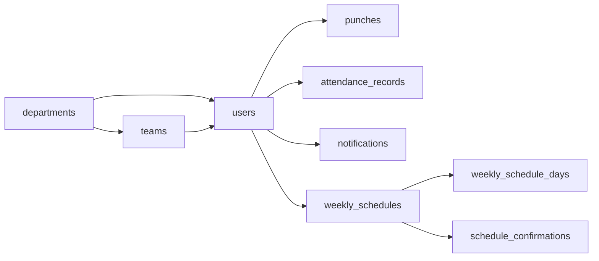

# Database tables summary (PostgreSQL)

Source of truth: `database/schema.sql`. Enum-like fields are stored as `VARCHAR` for JPA compatibility.

---

## `departments`

Organizational unit. Holds optional `admin_id` (FK to `users`) for department administration.

| Column | Notes |
|--------|--------|
| `id` | UUID PK |
| `name`, `description` | Department identity |
| `created_at` | Creation timestamp |
| `admin_id` | Nullable FK → `users` |

---

## `users`

People who can log in and/or appear as employees. Links to a department and optionally a team.

| Column | Notes |
|--------|--------|
| `id` | UUID PK |
| `email` | Unique login |
| `password` | Hashed credentials |
| `employee_id` | Business employee number, unique |
| `name`, `phone_number`, `hiring_date` | Profile |
| `status` | `ACTIVE`, `INACTIVE`, `ON_LEAVE` |
| `role` | `SUPER_ADMIN`, `ADMIN`, `DEPT_MANAGER`, `TEAM_LEADER`, `EMPLOYEE` |
| `department_id` | Nullable FK → `departments` |
| `team_id` | Nullable FK → `teams` (must be null for `SUPER_ADMIN`) |

Indexed on `email`, `employee_id`, `department_id`, `team_id`.

---

## `teams`

Team within a department; exactly one designated team leader (`team_leader_id` → `users`).

| Column | Notes |
|--------|--------|
| `id` | UUID PK |
| `name` | Team name |
| `department_id` | FK → `departments`, cascade delete |
| `team_leader_id` | FK → `users`, restrict delete |

Circular dependency note: `users.team_id` references `teams`; `teams` references `users` for leader — enforced via alter order in schema.

---

## `punches`

Raw clock punches for attendance workflow.

| Column | Notes |
|--------|--------|
| `id` | UUID PK |
| `user_id` | FK → `users`, cascade delete |
| `punch_type` | `WORK_START`, breaks, lunch, `LOGOUT`, etc. |
| `punched_at` | Instant of punch (timestamptz) |

Indexed `(user_id, punched_at DESC)`.

---

## `attendance_records`

Derived daily attendance per user: lateness vs expected start after evaluation (e.g. after logout).

| Column | Notes |
|--------|--------|
| `id` | UUID PK |
| `employee_id` | Denormalized copy of user’s employee id |
| `user_id` | FK → `users`, cascade delete |
| `record_date` | Calendar day |
| `status` | `ON_TIME`, `LATE`, `ABSENT` |
| `expected_start`, `actual_start` | Times for that day |
| `minutes_late` | Nullable integer |
| `created_at` | Row creation |

Unique `(user_id, record_date)`.

---

## `notifications`

In-app messages and schedule-related payloads.

| Column | Notes |
|--------|--------|
| `id` | UUID PK |
| `sender_id` | FK → `users` |
| `receiver_id` | Nullable; either this **or** `team_id` set |
| `team_id` | Nullable team-scoped broadcast |
| `notification_type` | `MESSAGE`, `SCHEDULE_CONFIRM`, `SCHEDULE_RESPONSE` |
| `message` | Human-readable text |
| `payload_json` | Optional JSON (e.g. schedule snapshot) |
| `created_at` | Timestamptz |
| `read_flag` | Read state |

Indexed for inbox / team feeds with `read_flag` and `created_at`.

---

## `weekly_schedules`

One saved week (Sunday `week_start` date) of planned hours for an employee user.

| Column | Notes |
|--------|--------|
| `id` | UUID PK |
| `employee_user_id` | FK → `users` (employee row) |
| `week_start` | Date of that week’s Sunday |
| `created_by_user_id` | Manager/admin who created/updated |
| `created_at`, `updated_at` | Audit timestamps |

Unique `(employee_user_id, week_start)`.

---

## `weekly_schedule_days`

Seven rows per schedule (optional pattern: `day_of_week` 0 = Sunday … 6 = Saturday).

| Column | Notes |
|--------|--------|
| `id` | UUID PK |
| `schedule_id` | FK → `weekly_schedules`, cascade delete |
| `day_of_week` | 0–6 |
| `day_off` | If true, typically no start/end |
| `start_time`, `end_time` | Local times when working |

Unique `(schedule_id, day_of_week)`.

---

## `schedule_confirmations`

Employee acknowledgement of a published weekly schedule for that week.

| Column | Notes |
|--------|--------|
| `id` | UUID PK |
| `schedule_id` | FK → `weekly_schedules`, cascade delete |
| `employee_user_id` | FK → `users` |
| `status` | `PENDING`, `CONFIRMED`, `CORRECTION_REQUESTED` |
| `comment` | Employee comment when responding |
| `responded_at` | When employee responded |
| `created_at`, `updated_at` | Audit |

Unique `(schedule_id, employee_user_id)`.

---

## Relationship overview

---

## Extensions

- `uuid-ossp` for `uuid_generate_v4()` defaults on PKs.
