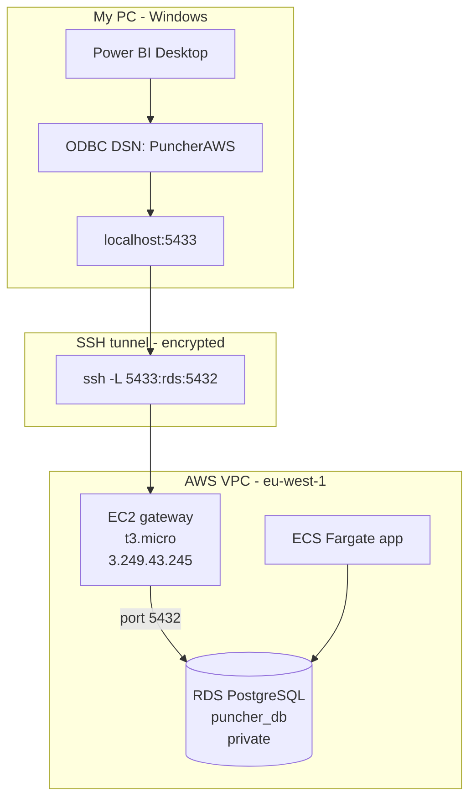

# How I Successfully Connected Power BI to My AWS PostgreSQL Database

This document describes the **Puncher Manager** project architecture, why a direct Power BI → RDS connection failed, and the **secure solution** that worked: **Power BI Desktop → ODBC → SSH tunnel → EC2 gateway → private RDS PostgreSQL**.

---

## Project architecture

I deployed **Puncher Manager** on Amazon Web Services using:

| Component | Role |
|-----------|------|
| **ECS Fargate** | Runs backend and frontend containers |
| **RDS PostgreSQL** | Application database (`puncher_db`) |
| **Terraform** | Infrastructure as code (VPC, RDS, ECS, ALB) |
| **GitHub Actions CI/CD** | Automatic build, test, and deploy on push to `main` |

The PostgreSQL database was intentionally deployed inside a **private VPC subnet** for security (`publicly_accessible = false` in Terraform).

```text
Internet
    │
    ▼
Application Load Balancer
    │
    ├──► ECS Fargate (backend + frontend)
    │         │
    │         ▼
    └──► RDS PostgreSQL (private subnet)
```

---

## Problem

I wanted to connect:

```text
Power BI Desktop  →  AWS PostgreSQL RDS
```

**Direct connection failed** because:

- The RDS database was **private** (not on the public internet).
- **Internet access to PostgreSQL was blocked** by design (security group only allows ECS + bastion).
- **Power BI could not reach the database directly** from my laptop.

| What I tried first | Result |
|--------------------|--------|
| RDS endpoint as server in Power BI | Timeout / unreachable |
| App login (`superadmin@puncher.com`) as DB user | Wrong — that is not the database user |

The database user is **`postgres`**; the password is **`db_password`** from `deploy/aws/terraform/terraform.tfvars`.

---

## Final professional solution

Instead of exposing the database publicly, I implemented a secure architecture using an **EC2 gateway** and **SSH tunneling**.

### Architecture (what worked)

```text
Power BI Desktop
        ↓
   ODBC Driver
        ↓
   SSH Tunnel
        ↓
  EC2 Gateway (public)
        ↓
Private RDS PostgreSQL
```



---

## Step-by-step process

### 1. Create an EC2 gateway

I created a small EC2 instance inside the **same VPC** as the RDS database.

| Setting | Value |
|---------|--------|
| AMI | Amazon Linux 2023 |
| Instance type | t3.micro |
| Public IP | Enabled |
| VPC | Same as RDS (`puncher-manager-vpc`) |
| Subnet | Public subnet in that VPC |

**Purpose:** act as a secure **bridge** between my laptop and the private database (bastion / jump host).

---

### 2. Create SSH key pair

During EC2 creation:

- I generated a **`.pem` key pair** (`puncher-powerbi-gateway2-keypair.pem`).
- I **downloaded** the private key file and kept it secure on my PC.
- I used it later for SSH access to the gateway.

---

### 3. Configure security groups

#### EC2 security group

| Rule | Purpose |
|------|---------|
| **SSH port 22** | Only from **my public IP** |

So only I can open an SSH session to the gateway.

#### RDS security group (`puncher-manager-rds`)

| Rule | Purpose |
|------|---------|
| **PostgreSQL port 5432** | Only from the **EC2 security group** (not from `0.0.0.0/0`) |

Terraform originally allows **5432 only from ECS**. I **added** an inbound rule so the bastion security group can also reach RDS.

This kept the database **private and secure** — not exposed to the whole internet.

---

### 4. Create SSH tunnel

Using **PowerShell** on Windows (leave this window **open** while using Power BI):

```powershell
ssh -i "C:\Users\deselmaar\Downloads\puncher-powerbi-gateway2-keypair.pem" `
  -L 5433:puncher-manager-postgres.cje2qymy83zz.eu-west-1.rds.amazonaws.com:5432 `
  ec2-user@3.249.43.245
```

| Part | Meaning |
|------|---------|
| `-L 5433:...:5432` | On my PC, port **5433** forwards to RDS port **5432** |
| `puncher-manager-postgres....rds.amazonaws.com` | Private RDS endpoint |
| `ec2-user@3.249.43.245` | EC2 gateway public IP |
| `.pem` file | SSH private key |

**Resulting path:**

```text
localhost:5433  →  (SSH encrypted)  →  EC2  →  RDS:5432
```

I used local port **5433** (not 5432) to avoid conflict with other services on my machine.

---

### 5. Verify tunnel

Using PowerShell:

```powershell
Test-NetConnection localhost -Port 5433
```

**Result:**

```text
TcpTestSucceeded : True
```

Meaning: the **SSH tunnel worked** before opening Power BI.

---

### 6. Install PostgreSQL ODBC driver

The native **Power BI PostgreSQL connector** caused **SSL certificate validation** problems when pointed at `localhost` through the tunnel.

**Solution:** install **PostgreSQL ODBC Driver (64-bit)** (psqlODBC / Npgsql-based driver for Windows).

Download from PostgreSQL or a trusted ODBC driver package for Windows x64.

---

### 7. Configure ODBC data source

Open **ODBC Data Sources (64-bit)** (Windows) and create a **User DSN** named **`PuncherAWS`**:

| Setting | Value |
|---------|--------|
| **Server** | `localhost` |
| **Port** | `5433` |
| **Database** | `puncher_db` |
| **Username** | `postgres` |
| **Password** | From `terraform.tfvars` → `db_password` |
| **SSL Mode** | `require` (if the driver exposes it) |

Power BI connects to the DSN; the DSN connects through the tunnel to RDS.

---

### 8. Connect Power BI

In **Power BI Desktop**:

1. **Home** → **Get data** → **More…**
2. Search **ODBC**
3. Select DSN **`PuncherAWS`**
4. Choose **Import** (recommended for first reports)
5. Select tables (e.g. `users`, `punches`, `attendance_records`, `teams`, `departments`)
6. **Load**

Power BI successfully loaded the PostgreSQL tables from **AWS RDS**.

---

## Connection settings reference

| Layer | Setting | Value |
|-------|---------|--------|
| Power BI | Data source | ODBC → `PuncherAWS` |
| ODBC | Server | `localhost` |
| ODBC | Port | `5433` |
| ODBC | Database | `puncher_db` |
| ODBC | User | `postgres` |
| ODBC | Password | `db_password` in `terraform.tfvars` |
| SSH tunnel | Local port | `5433` |
| SSH tunnel | Remote | RDS endpoint `:5432` |
| SSH tunnel | Gateway | `ec2-user@<EC2_PUBLIC_IP>` |
| RDS | Endpoint | `terraform output rds_endpoint` |

Get RDS endpoint:

```powershell
cd deploy\aws\terraform
terraform output rds_endpoint
```

---

## Key technical concepts learned

### AWS services

| Service | What I learned |
|---------|----------------|
| **ECS Fargate** | Runs containers without managing servers |
| **RDS PostgreSQL** | Managed database in a private subnet |
| **EC2** | Gateway / bastion for secure access |
| **VPC** | Isolated network; public vs private subnets |
| **Security groups** | Firewall rules per resource (ECS → RDS, bastion → RDS) |

### DevOps

| Topic | What I learned |
|-------|----------------|
| **Terraform** | Infrastructure as code for repeatable AWS setup |
| **CI/CD** | GitHub Actions builds images and deploys to ECS |
| **Private RDS** | Safer than public DB; requires a controlled access path |

### Networking

| Topic | What I learned |
|-------|----------------|
| **Private subnets** | RDS not reachable from the internet |
| **SSH tunneling** | Encrypted port forwarding from laptop → VPC |
| **Bastion / gateway** | Jump host pattern used in production |
| **Secure database access** | No need to make RDS public for analytics |

### Data analytics

| Topic | What I learned |
|-------|----------------|
| **Power BI** | Reports and dashboards on live data |
| **ODBC** | Reliable driver path when native connector has SSL issues |
| **PostgreSQL integration** | Star schema: facts (`punches`, `attendance_records`) + dimensions (`users`, `teams`) |

---

## Security advantages

This solution is secure because:

| Point | Why it matters |
|-------|----------------|
| PostgreSQL remains **private** | No public RDS endpoint for the world |
| Database is **not** exposed on `0.0.0.0/0` | Only VPC-internal + controlled bastion |
| Only the **EC2 gateway** can access RDS on 5432 | RDS SG allows bastion SG, not the internet |
| Power BI uses **encrypted SSH tunneling** | Traffic protected in transit |
| SSH limited to **my IP** on port 22 | Reduces who can open a tunnel |

This architecture is close to **real production cloud environments** (bastion + private database).

---

## Daily workflow

1. Start the **SSH tunnel** (PowerShell — keep window open).
2. Optional: `Test-NetConnection localhost -Port 5433`.
3. Open **Power BI Desktop** → connect via **ODBC** → `PuncherAWS`.
4. Refresh or build reports.
5. Close Power BI and stop SSH when finished.

---

## Troubleshooting

| Problem | Likely cause | Fix |
|---------|----------------|-----|
| `TcpTestSucceeded : False` | Tunnel not running | Start SSH command again |
| Power BI timeout | Tunnel closed or wrong port | Use `5433` everywhere (ODBC + tunnel) |
| Password failed | Wrong password | Use `db_password` from `terraform.tfvars`, not app login |
| Native PostgreSQL connector SSL error | Certificate on localhost path | Use **ODBC** as in this guide |
| Port 5432 in use on PC | Another Postgres/local service | Use **5433** for local tunnel port |
| RDS still unreachable from PC | Connecting to RDS hostname in Power BI | Use **`localhost`** and the tunnel only |

---

## How this relates to the live application

| Path | Purpose |
|------|---------|
| **Users → ALB → ECS → RDS** | Production Puncher Manager (CI/CD deploy) |
| **Power BI → ODBC → SSH → EC2 → RDS** | Analytics and reporting |

Both use the **same RDS database**; only the **network path** differs.

---

## Related project files

| File | Topic |
|------|--------|
| [README.md](./README.md) | AWS deploy overview |
| [terraform/](./terraform/) | VPC, RDS, ECS |
| [../../cicd-explained.md](../../cicd-explained.md) | GitHub Actions CI/CD |
| [../../dbtables.md](../../dbtables.md) | Database tables for Power BI model |
| [../../accessDB04.md](../../accessDB04.md) | Local Docker Postgres (alternative) |

---

## Summary

| Step | Outcome |
|------|---------|
| Deploy app on **ECS + private RDS** | Secure production architecture |
| Direct Power BI → RDS | **Failed** (private DB) |
| **EC2 gateway + security groups + SSH tunnel** | Secure bridge into VPC |
| **ODBC on `localhost:5433`** | **Success** — tables loaded in Power BI |

```text
Power BI Desktop  →  ODBC (PuncherAWS)  →  localhost:5433
    →  SSH tunnel  →  EC2 gateway  →  Private RDS PostgreSQL (puncher_db)
```

This is the documented, professional way I connected **Power BI** to my **AWS PostgreSQL** database without exposing RDS to the public internet.
